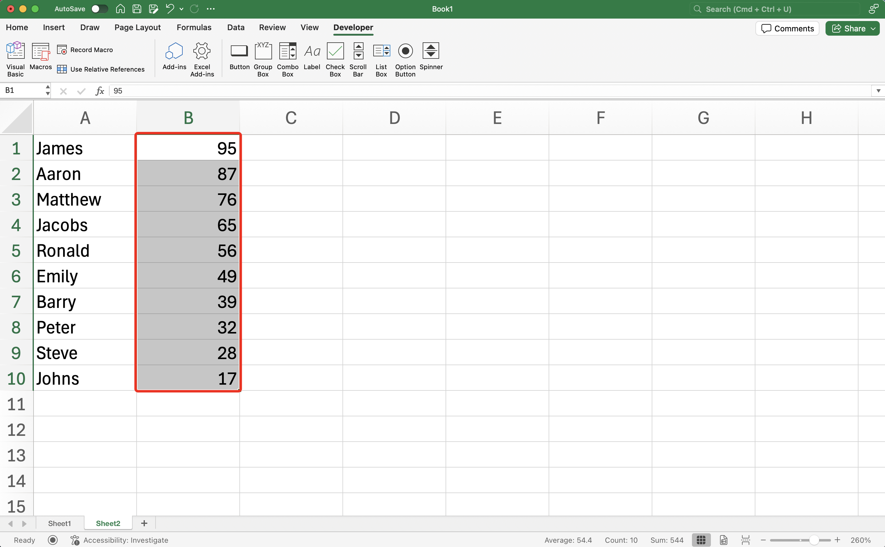
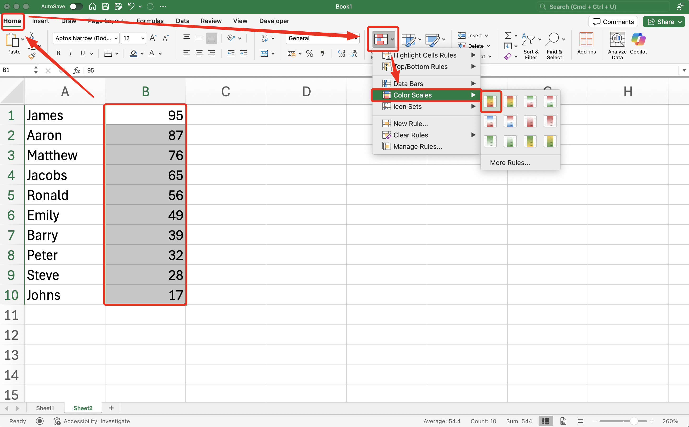
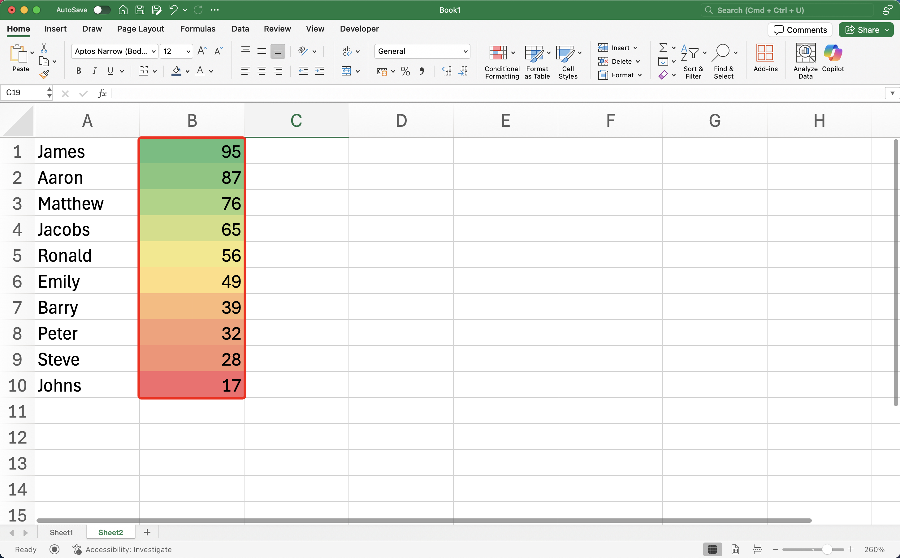

import InfoBox from '@/components/mdx/InfoBox.astro'

When analyzing data, our eyes are easier to see visual cues to see pattern in data. We can use color scales to see the value range between one data with another. In this tutorial, I'll show you how to use Color Scales to coloring cell based on Value in Microsoft Excel. 

## Pre-requisite
- Use Microsoft Excel, either you can purchase it with license or using free [Microsoft 365 Online](https://www.microsoft.com/en-us/microsoft-365/free-office-online-for-the-web#:~:text=Use%20Microsoft%20365%20apps%20for,the%20web%20(formerly%20Office).)
## Steps
Here are the steps to color cells in [Microsoft Excel](https://excel.cloud.microsoft) based on value using Conditional Formatting

1. __Select__ the range all of the data you want to color.

2. Go to __Home__, then select __Conditional Formatting__
3. Dropdown will appear, then select __Color Scales__, then select color you prefer.

4. Your range of data will be colored based on its value

<InfoBox type="inform">
__Insight__: By default, Color Scales will colors your data from highest to lowest value. If you want to define the higher and lowest value, you can go to __Conditional Formatting__ > __Manage Rules__ > __Edit Rule__ > Define the highest and lowest value > __OK__.
</InfoBox>

By doing this steps, you should success coloring cells based on Value in Microsoft Excel.