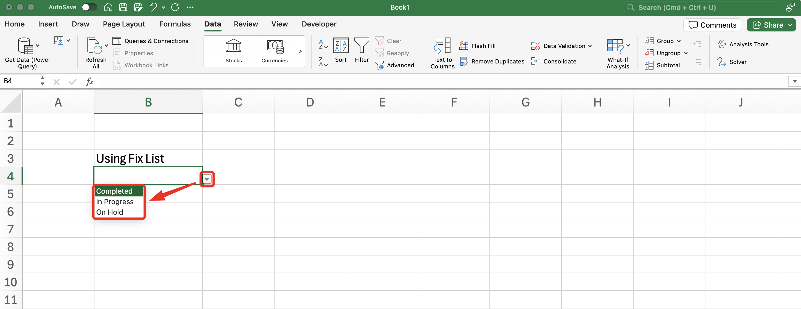

import InfoBox from '@/components/mdx/InfoBox.astro'

Data Validation feature in Microsoft Excel can be useful when you want to make sure other person that using your Excel won't messed up. Using Data Validation, we can define the options that allowed to input. In this tutorial, I will explain tutorial on how to create Dropdown using Data Validation in Microsoft Excel.
## Pre-requisite
- Use Microsoft Excel, either you can purchase it with license or using free [Microsoft 365 Online](https://www.microsoft.com/en-us/microsoft-365/free-office-online-for-the-web#:~:text=Use%20Microsoft%20365%20apps%20for,the%20web%20(formerly%20Office).)

## Steps
1. Go to __Data__ tab, then go to __Data Validation__

2. A pop up will appear > Select options __List__ from __Allow__ dropdown

3. There are 2 (two) ways you can input the options. First ways on the step 4-6, second on the step 7-9.

4. First way is using direct text to fill the options on the Dropdown window

5. Click OK

6. The final result is as below. You'll have (3) three options as you fill on the Data Validation window.

7. Second way is using __Cell Reference__. Click the __Formula Bar__ below the Source

8. Drag the cursor to the options that already filled on the cells

9. Click __OK__

By doing these steps, you should be successfully create dropdown using Data Validation in [Microsoft 365 Online](https://www.microsoft.com/en-us/microsoft-365/free-office-online-for-the-web#:~:text=Use%20Microsoft%20365%20apps%20for,the%20web%20(formerly%20Office)) 

