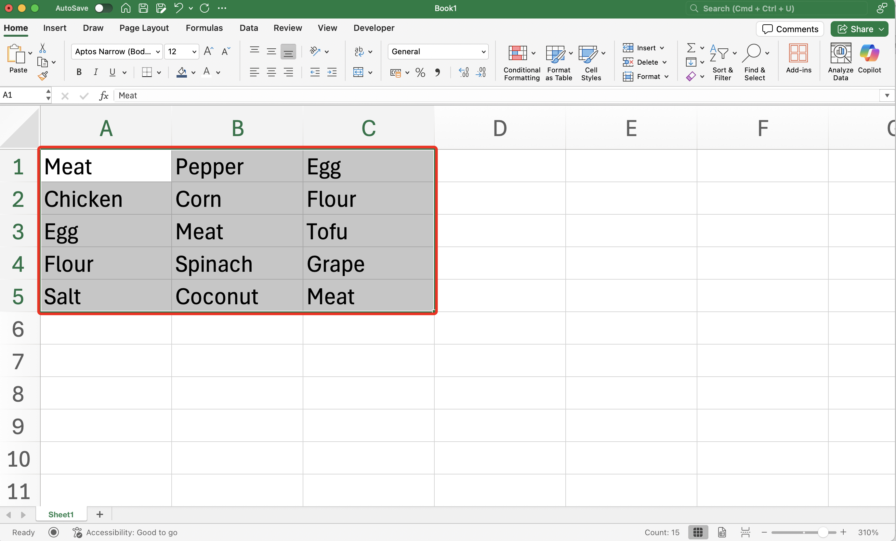
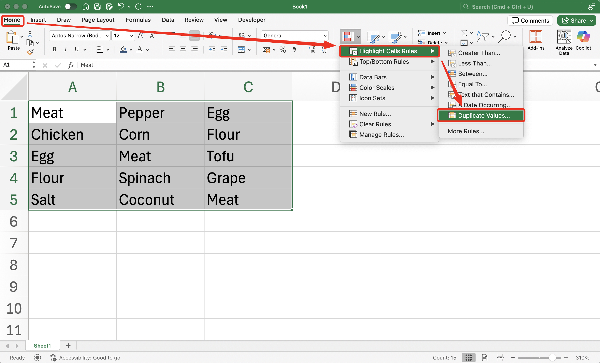
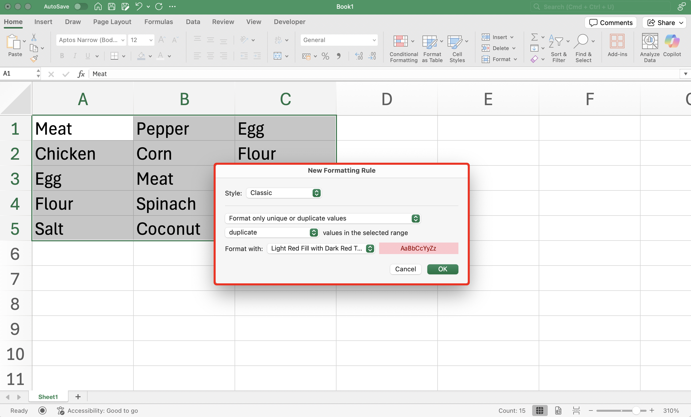
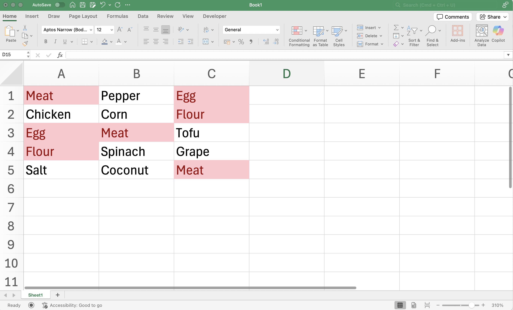

import InfoBox from '@/components/mdx/InfoBox.astro'
import Challenge from '@/components/mdx/Challenge.astro'
import { Icon } from 'astro-icon/components'
import Day0 from 'assets/frame4.png'

Finding duplicate value in Microsoft Excel can be frustrating. Even though there are many ways to do that. Here on this tutorial, I will explain how you can find duplicate value in Microsoft Excel using Highlight in Conditional Formatting.

## Pre-requisite
- Use Microsoft Excel, either you can purchase it with license or using free [Microsoft 365 Online](https://www.microsoft.com/en-us/microsoft-365/free-office-online-for-the-web#:~:text=Use%20Microsoft%20365%20apps%20for,the%20web%20(formerly%20Office).)
## Steps
Here are the steps to find duplicate value in Microsoft Excel using Highlights in Conditional Formatting

1. Select the range of all of the data you want to find.

<InfoBox type="inform">
**Info:** If all the range are in one column, you can select the range by clicking the Column Name. Can also applied if range in one row, you can select range by clicking Row Number. It is faster than dragging using pointer
</InfoBox>

2. Go to __Home__ menu, then go to __Conditional Formatting__
3. Dropdown will appear, then select __Highlight Cell Rules__
4. Then select __Duplicate Value__

5. Pop Up __New Formatting Rules__ will appear, then select __OK__.

<InfoBox type="inform">
__Insight:__ On this pop up, you can set the fill color and font color that will appear when the rules is match. By default, the fill color is light red and font color is dark red.
</InfoBox>

6. The pop up will dissapear and the duplicate value will highlighted red

After doing these steps, you will see which cell has duplicate values with all the range you previously selected.

## Conclusion
Steps explained above are how to find duplicate value in Microsoft Excel particularly using Highlight in Conditional Formatting. Even though, there are several ways to find such using different methods that I will explain on other posts. See you!
