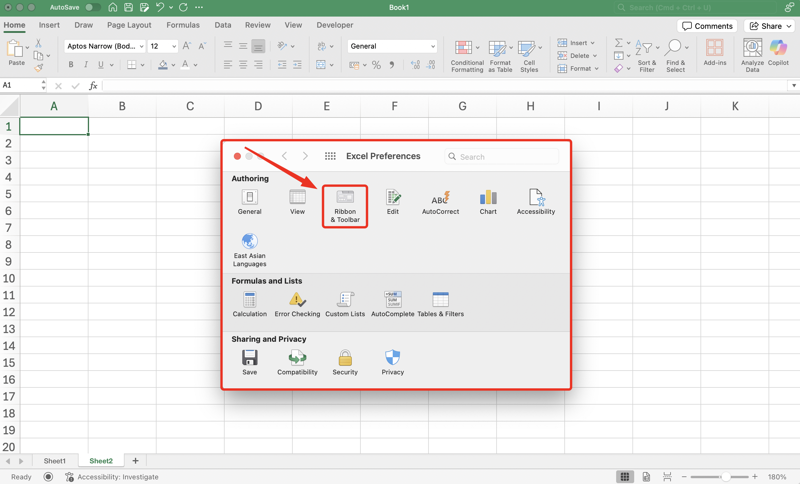
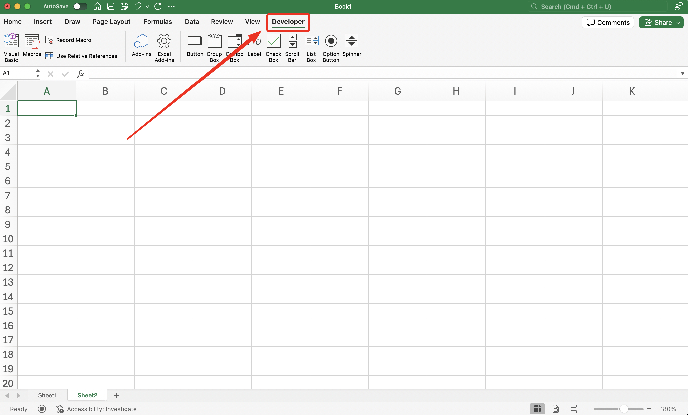

import InfoBox from '@/components/mdx/InfoBox.astro'
import Challenge from '@/components/mdx/Challenge.astro'
import { Icon } from 'astro-icon/components'

When you open Microsoft Excel for the first time, Developer tab is somewhat missing. But actually this hidden tab is pack with important features in Microsoft Excel. In this tutorial, I show you how you can enable/show Developer tab in Microsoft Excel.

## Benefits
You may wonder why we need to enable the Developer Tab in Excel. Or what are the benefit enabling this feature in the first place. On the Developer Tab, we can:
- Create automation using Macro VBA
- Add interactive widget like button, scroll bar, form box etc.
- Add Excel Add-ins

## Pre-requisite
- Use Microsoft Excel, either you can purchase it with license or using free [Microsoft 365 Online](https://www.microsoft.com/en-us/microsoft-365/free-office-online-for-the-web#:~:text=Use%20Microsoft%20365%20apps%20for,the%20web%20(formerly%20Office).)
## Steps
Here are the steps to enable or show Developer Tab in Excel on Mac OS
1. Go to __Excel__ menu on the top left of the screen, then select __Preferences__

2. New pop up __Excel Preferences__ will appear.
3. On the Authoring section, click option __Ribbon & Toolbar__

4. On the right side of the windows, you can check __Developer Tab__ check box. If you don't see the Developer Tab check box, scroll down until bottom.

5. Click __Save__

After you save it, Developer Tab should appear on the Toolbar Menu right next to View Tab and that's how you can enable/show Developer tab in Microsoft Excel.